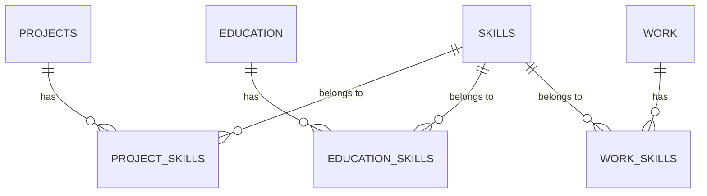

# Portfolio - Next.js & Supabase

Un **portfolio moderne** développé avec **Next.js** et **Supabase**, permettant de présenter mes **4 projets sélectionnés**, mes **formations techniques**, mes **expériences professionnelles**, ainsi que mes **compétences utilisées et démontrées**.
Le projet intègre également un **dashboard d’administration** pour gérer facilement les contenus (projets, formations, expériences et compétences).

Ce projet est un **apprentissage de l’utilisation de l’IA** et a été créé avec du code provenant de prompts ChatGPT, à l’aide de mes propres prompts et corrections.

---

## 🏗️ Stack technique

* **Framework** : [Next.js](https://nextjs.org/)
* **Base de données & Auth** : [Supabase](https://supabase.com/)
* **Cloud storage** : [Cloudinary](https://cloudinary.com/)
* **Styling** : CSS pur (`globals.css`, `variables.css` et modules CSS par composant)
* **Déploiement** : [Netlify](https://www.netlify.com/)

---

## Structure du projet

```
portfolio/
├── app/                  # Pages Next.js (App Router)
│   ├── dashboard/        # Dashboard admin (projects, education, skills, work)
│   ├── login/            # Page de connexion
│   ├── layout.js         # Layout global
│   ├── page.js           # Page d’accueil
│   ├── not-found.js      # Page 404 custom
│   └── favicon.ico
│
├── assets/               # Images et icônes statiques
│
├── components/           # Composants UI (Hero, Header, Projects, Skills, etc.)
│
├── context/              # Providers globaux (ex: AuthProvider.js)
│
├── hook/                 # Hooks personnalisés (ex: useMediaQuery.js)
│
├── lib/                  # Configs (supabase, cloudinary)
│
├── styles/               # Styles globaux et variables CSS
│
└── README.md             # Documentation
```

---

## Fonctionnalités

### Frontend (Portfolio)

* Mise en avant de **4 projets sélectionnés**
* Présentation brève de mes **formations techniques**
* Sélection de mes **expériences professionnelles uniquement techniques**
* Liste dédiée à mes **compétences, toutes prouvées par un projet ou une expérience**
* Mise en avant de mes **références** et contacts
* Design responsive en **CSS pur**
* **Thème** clair et sombre, modulable
* Section **Blog** connecté à l'API dev.to

### 🛠️ Backend (Dashboard)

* **Sauvegarde** : toutes les données sont stockées dans **Supabase** et mises à jour en temps réel sur le portfolio.
* **Authentification** via Supabase, accessible via l’URL `/login` et protégée par l’authentification GitHub (seul mon GitHub permet la connexion).
* **Projets** : ajout, édition, suppression et affichage sous forme de grille
* **Formations (Education)** : ajout, édition, suppression et affichage sous forme de timeline
* **Expériences professionnelles (Work)** : ajout, édition, suppression et affichage sous forme de timeline
* **Compétences (Skills)** : ajout, édition et gestion complète avec tags et association possible aux autres contenus

---

## Construire le projet

### Prérequis

👉 Outils nécessaires pour faire tourner le projet :

* **Supabase** : gestion de la base de données et de l’authentification
* **Cloudinary** : upload et gestion des images

### Configuration & Variables d’environnement

Avant de lancer le projet, crée un fichier `.env` à la racine avec :

```bash
NEXT_PUBLIC_SUPABASE_URL=your-supabase-url
NEXT_PUBLIC_SUPABASE_ANON_KEY=your-supabase-anon-key

CLOUDINARY_API_KEY=your-cloudinary-api-key
NEXT_PUBLIC_CLOUDINARY_CLOUD_NAME=your-cloudinary-cloud-name
NEXT_PUBLIC_CLOUDINARY_UPLOAD_PRESET=your-upload-preset
```

### Installation et lancement

```bash
# Cloner le repo
git clone https://github.com/ton-username/portfolio.git
cd portfolio

# Installer les dépendances
npm install

# Lancer le projet en mode développement
npm run dev
```

Le projet sera disponible sur `http://localhost:3000/`.

---

## 📖 Guide d’utilisation du Dashboard

1. **Connexion**

   * Rendez-vous sur `/login`
   * Connectez-vous avec vos identifiants administrateur (gérés par Supabase)

2. **Gestion des contenus**

   * 📂 **Projets** : `/dashboard/projects` → créer, éditer ou supprimer un projet
   * 🎓 **Éducation** : `/dashboard/education` → ajouter une formation ou une certification
   * 💼 **Expériences professionnelles** : `/dashboard/work` → gérer vos expériences avec détails et vue complète
   * 🧩 **Compétences** : `/dashboard/skills` → ajouter, modifier ou supprimer des compétences avec un sélecteur visuel

---

## ⚙️ Setup Supabase (tables & schéma)

Ton portfolio utilise **Supabase (PostgreSQL)** pour stocker et gérer les données du **dashboard** (projets, formations, expériences et compétences).
Voici le schéma recommandé :



### 🗂️ Tables principales

```sql
-- Table des compétences
CREATE TABLE skills (
  id uuid PRIMARY KEY DEFAULT gen_random_uuid(),
  name text NOT NULL,
  type text,
  link text
);

-- Table des projets
CREATE TABLE projects (
  id uuid PRIMARY KEY DEFAULT gen_random_uuid(),
  title text,
  description text,
  imglink text,
  repourl text,
  demourl text,
  date date,
  fav boolean,
  education_id uuid REFERENCES education(id)
);

-- Table des formations (éducation)
CREATE TABLE education (
  id uuid PRIMARY KEY DEFAULT gen_random_uuid(),
  institution text,
  certificationUrl text,
  area text,
  studytype text,
  startDate date,
  endDate date,
  summary text,
  active boolean,
  location text,
  visibility boolean
);

-- Table des expériences professionnelles
CREATE TABLE work (
  id uuid PRIMARY KEY DEFAULT gen_random_uuid(),
  enterpriseName text,
  job text,
  location_type text,
  location text,
  startDate date,
  endDate date,
  summary text,
  highlights jsonb,
  mission jsonb,
  active boolean
);
```

### 🔗 Tables de relation (many-to-many)

```sql
-- Relations projets <-> compétences
CREATE TABLE project_skills (
  project_id uuid REFERENCES projects(id) ON DELETE CASCADE,
  skill_id uuid REFERENCES skills(id) ON DELETE CASCADE,
  PRIMARY KEY (project_id, skill_id)
);

-- Relations éducation <-> compétences
CREATE TABLE education_skills (
  education_id uuid REFERENCES education(id) ON DELETE CASCADE,
  skill_id uuid REFERENCES skills(id) ON DELETE CASCADE,
  PRIMARY KEY (education_id, skill_id)
);

-- Relations travail <-> compétences
CREATE TABLE work_skills (
  work_id uuid REFERENCES work(id) ON DELETE CASCADE,
  skill_id uuid REFERENCES skills(id) ON DELETE CASCADE,
  PRIMARY KEY (work_id, skill_id)
);
```

---

### 📌 Notes importantes

* Les colonnes **`uuid`** utilisent `gen_random_uuid()` → assure-toi que l’extension `pgcrypto` est activée dans Supabase :

  ```sql
  CREATE EXTENSION IF NOT EXISTS "pgcrypto";
  ```

* Les colonnes **`jsonb`** (`highlights`, `mission`) dans `work` permettent de stocker des listes ou objets complexes (ex: missions d’un poste).

* Les relations `project_skills`, `education_skills`, `work_skills` permettent de lier plusieurs **skills** à un projet, une formation ou une expérience.

---

## Fonctionnalités futures

* Créer la gestion des références dans Supabase
* Ajout d’une section **Centres d’intérêts**
* Optimisation de la **performance** et du **SEO**

---

## 📜 Licence

Projet personnel codé avec l'aide de ChatGPT – usage libre pour inspiration et apprentissage.


